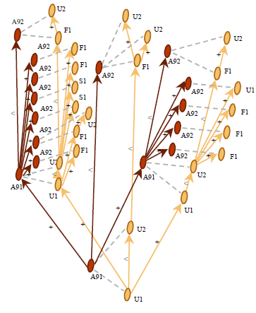
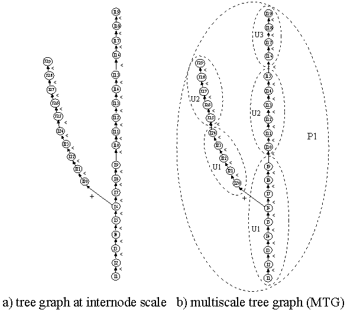
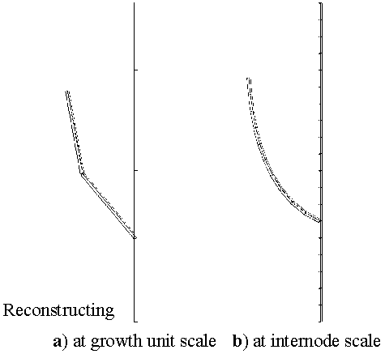
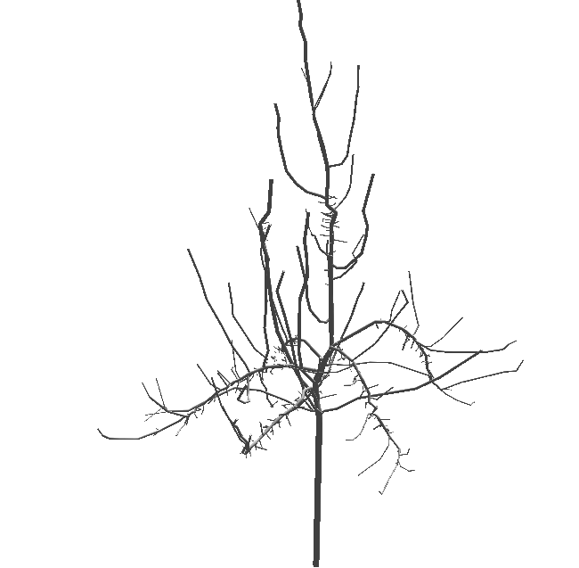
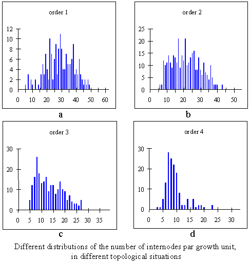

.. testsetup::

    from openalea.mtg.aml import *

.. contents::

.. _newmtg_intro:

MTG file 
##################

:mod:`openalea.mtg` provides a Multiscale Tree Graph data structure (MTG) that is compatible with the standard MTG format that was defined in the AMAPmod software.
For compatibility reasons, the same interfaces have been implemented in this package. However, this is a completly new implementation written in Python that will evolve
by adding new functionalities and algorthims.

MTG: a Plant Architecture Databases
===================================

Overview
--------

In OpenAlea/VPlants projects, plants are formally represented by multiscale tree graphs (MTGs) [20]_.
A MTG consists of a set of layered tree graphs,
representing plant topology at different scales (internodes, growth units, axes, etc.).

To build up MTGs from plants, plants are first broken down into plant components,
organised in different scales (`Figure3.2.a`_ and `Figure3.2.b`_).
Components are given labels that specify their types
(`Figure3.2.b`_, `U` = growth unit, `F` = flowering site, `S` = short shoot, `I` = internode).
These labels are then used to encode the plant architecture into a textual form.
The resulting coding file (`Figure3.2.c`_) can then be analysed by :mod:`openalea.mtg` tools to build
the corresponding MTG (`Figure3.2.d`_).

.. _Figure3.2.a:
.. figure:: fig3_2_a.png
    :align: left
    :width: 100%
    :height: 300px
    :figclass: align-left

    **Figure 3.2,a** Starting from real plants, measurements are made.

.. _Figure3.2.b:
.. figure:: fig3_2_b.png
    :align: left
    :width: 100%
    :height: 300px
    :figclass: align-right

    **Figure 3.2.b** Plants components are identified and labelled (e.g, U for growth unit)

.. _Figure3.2.d:
.. figure:: fig3_2_d.png
    :align: left
    :width: 100%
    :height: 300px
    :figclass: align-left

    **Figure 3.2.c** The plant components and their attributes are encoded in a MTG file

.. _Figure3.2.c:

    **Figure 3.2.d** A MTG representing the branching system can be built from the MTG. The plant representation at annual shoot scale is in red and at growth unit in yellow.

Explanations
------------
In an MTG, the organisation of plant components at a given scale of detail is represented by a tree graph, where each component is represented by a vertex in the graph and edges represent the physical connections between them. At any given scale, the plant components are linked by two types of relation, corresponding to the two basic mechanisms of plant growth, namely the apical growth and the branching processes. Apical growth is responsible for the creation of axes, by producing new components (corresponding to new portions of stem and leaves) on top of previous components. The connection between two components resulting from the apical growth is a **precedes** relation and is denoted by a **<** character.

On the other hand, the branching process is responsible for the creation of axillary buds
(these buds can then create axillary axes with their own apical growth). 
The connection between two components resulting from the branching process 
is a **bears** relation and is denoted by a **+** character.
A MTG integrates -- within a unique model -- the different tree graph representations 
that correspond to the different scales at which the plant is described.

Various types of attribute can be attached to the plant components represented in the MTG,
at any scale. Attributes may be geometrical 
(e.g., diameter of a stem, surface area of a leaf or 3D positioning of a plant component) 
or morphological (e.g., number of flowers, nature of the associated leaf, 
type of axillary production - latent bud, short shoot or long shoot -).

MTGs can be constructed from field observations using textual encoding of the plant 
architecture as described in [22]_ (see `Figure3.2.a`_). 
Alternatively, code files representing plant architectures can also be constructed 
from simulation programs that generate artificial plants, 
or directly from any Python program, as we will illustrate it in the :ref:`newmtg_tutorial`.

.. todo:: fix the internal link reference

The code files usually have a spreadsheet format and contain the description of 
plant topology in the first few columns and the description of attributes attached 
to plant components on subsequent columns. 

Coding Individuals
==================

Different strategies have been proposed for recording topological structures of real plants, e.g. [43]_, [32]_ for plant represented at a single scale and [21]_, [25]_, for multiscale representations. In OpenAlea/Vplants, plant topological structures are abstracted as multiscale tree graphs. Describing a plant topology thus consists of describing the multiscale tree graph corresponding to this plant. The description of a given plant can be specified using a **coding language**. This language consists of a naming strategy for the vertices and the edges of multiscale graphs. A graph description consists of enumerating the vertices consecutively using their names. The name of a vertex is constructed in such a way that it clearly defines the topological location of a given vertex in the overall multiscale graph. The vertices and their features are described using this formal language in a so called **code file**. Let us illustrate the general principle of this coding language by the topological structure of the plant depicted in `Figure3.3`_.

.. _Figure3.3:
.. figure:: fig3_3.png
    :align: center

    **Figure 3.3** Coding the topological structure of a two year old poplar tree

Each vertex is associated with a **label** consisting of a letter, called its **class**, and an integer, called its **index**. The class of a vertex often refers to the nature of the corresponding botanical entity, *e.g.* `I` for internode, `U` for growth unit, `B` for branching system, etc. The index of a vertex is an integer which enables the user to locally identify a vertex among its immediate neighbors. Apart from this purely structural role, indexes may be used to convey additional meaning: they can be used for instance to encode the year of growth of an entity, its rank in an axis, etc.

At a given scale, plants are inspected by working upwards from the base of the trunk and symbols representing each vertex and its relationship to its father are either written down or keyed directly into a laptop computer.

.. _Figure3.4:

    **Figure 3.4**

The coded string starts with the single symbol **/**. Coding a single axis (e.g. the series of internodes of the trunk depicted in `Figure3.4`_ a) would then yield the string:

.. code-block:: python

    /I1<I2<I3<I4<I5<I6<I7<I8<I9<I10<I11<I12<I13<I14<I15<I16<I17<I18<I19

For a branching structure ( `Figure3.4`_ a), encoding a tree-like structure in a linear sequence of symbols leads us to introduce a special notation, frequently used in computer science to encode tree-like structures as strings (e.g. [39]_). A square bracket is opened each time a bifurcation point is encountered during the visit (i.e. for vertices having more than one son). A square bracket is closed each time a terminal vertex has just been visited (i.e. a vertex with no son) and before backtracking to the last bifurcation point. In the above example, entity `I6` is a bifurcation point since the description process can either continue by visiting entity `I7` or `I20`. In this case, the bifurcation point `I6` is first stored in a bifurcation point stack (which is initially empty). Secondly, an opened square bracket is inserted in the output string and thirdly, the visiting process resumes at one of the two possible continuations, for example `I20`, leading to the following code :

.. code-block:: python 

    /I1<I2<I3<I4<I5<I6[+I20

The entire branch `I20` to `I28` is then encoded like entities `I1` to `I6`. Entity `I29` has no son, and thus is a terminal entity. This results in inserting a closed square bracket in the string :

.. code-block:: python

    /I1<I2<I3<I4<I5<I6[+I20<I21<I22<I23<I124<I25<I26<I27<I28<I29]

The last bifurcation point can then be popped out of the bifurcation point stack and the visiting process can resume on the next possible continuation of `I6`, i.e. `I7`, leading eventually to the final output code string:

.. code-block:: python

    /I1<I2<I3<I4<I5<I6[+I20<I21<I22<I23<I124<I25<I26<I27<I28<I29]<I7<I8<I9<I10<I11<I12<I13<I14<I15<I16<I17<I18<I19]

Let us now extend this coding strategy to multiscale structures. Consider a plant described at three different scales, for example the scale of internodes, the scale of growth units and the scale of plants (`Figure3.4`_ b). The depth first procedure explained above is generalized to multiscale structures in the following way. The multiscale coding strategy consists basically of describing the plant structure at the highest scale in a depth first order. However, during this process, each time a boundary of a macroscopic entity is crossed when passing from entity a to entity b, the corresponding macroentity label, suffixed by a '/', must be inserted into the code string just before the label of b and after the edge type of (a,b). If more than one macroscopic boundary is crossed at a time, corresponding labels suffixed by '/' must be inserted into the code string at the same location, labels of the most macroscopic entities first. In the multiscale graph of `Figure3.4`_ b for example, the depth first visit is carried out at the internode level (highest scale). The visit starts by entering in vertex I1 at the scale of internodes. However, to reach this entity from the outside, we cross boundaries of P1 and U1, in this order. Then the depth first visit starts by creating the code string :

.. code-block:: python

    /P1/U1/I1

Then, the coding procedes through vertices `I1` to `I6`, with no new macroscopic boundary encountered. `I6` is a bifurcation point and as explained above, this vertex is stored in the bifurcation point stack, a '[' is inserted in the code string and the depth first process continues on the son of `I6` whose label is `I20`. Since to reach `I20` from `I6` the macroscopic boundary of the first growth unit of the branch is crossed, on `I20` the generated code string is

.. code-block:: python

    /P1/U1/I1<I2<I3<I4<I5<I6[+U1/I20

Similarly on the new branch, coding continues and crosses a growth unit boundary between internodes I24 and I25 :

.. code-block:: python

    /P1/U1/I1<I2<I3<I4<I5<I6[+U1/I20<I21<I22<I23<I24<U2/I25<I26<I27<I28<I29]

Once the end of the branch is reached at entity I29, a ']' is inserted in the code string and the process backtracks to bifurcation point I6 in order to resume the visit at the internode scale on the next son of I6, i.e. I7. Then coding goes through to the end of the poplar trunk since there are no more bifurcation points. Between entities I7 and I19, two growth unit boundaries are crossed which generate the final code string :

.. code-block:: python

    /P1/U1/I1<I2<I3<I4<I5<I6[+U1/I20<I21<I22<I23<I24<U2/I25<I26<I27]<I28<I29<I7<I8<I9<U2/I10<I11<I12<I13<I14<I15<U3/I16<I17<I18<I19]

It is often the case in practical applications that a number of attributes are measured on certain plant entities. Measured values can be attached to corresponding entities using a bracket notation, '{...}'. For instance, assume that one wants to note the length and the diameter of observed growth units. For each measured growth unit, a pair of ordered values defines respectively its measured length and diameter. Then, the precedent code string would become:

.. code-block:: python

    /P1/U1{10,5.9}/I1<I2<I3<I4<I5<I6[+U1{7,3.5}/I20<I21<I22<I23<I24<U2{4,2.1}/I25<I26<I27<I28<I29]<I7<I8<I9<U2{8,4.3}/I10<I11<I12<I13<I14<I15<U3{7.5,3.9}/I16<I17<I18<I19

In this string, we can read that the first growth unit of the trunk, U1, has length 10 cm and diameter 5.9 mm (units are assumed to be known and fixed).

In practical applications, coding plants as raw sequences of symbols becomes quite unreadable. In order to give the user a better feedback of the plant topology in the code itself, we can slightly change the above code format in order to achieve better legibility. Each square bracket is replaced by a new line and an indentation level corresponding to the nested degree of this square bracket. Similarly, a new line is created after each feature set and the feature values are written in specific columns. The following table gives the final code corresponding to the example in `Figure3.3`_ .

.. code-block:: python

                                                        Length      Diameter
    /P1/U1                                                  10          5.9
    /I1<I2<I3<I4<I5<I6
            +U1                                             7           3.5
            /I20<I21<I22<I23<I24<U2                         4           2.1
            /I25<I26<I27<I28<I29
    <I7<I8<I9<U2                                            8           4.3
    /I10<I11<I12<I13<I14<I15<U3                             7.5         3.9
    /I16<I17<I18<I19

.. code-block:: raw

    ENTITY-CODE                         Length  Diameter
    /P1/U1                          10. 5.9
    ^/I1<I2<I3<I4<I5<I6
        +U1                     7   3.5
        ^/I20<I21<I22<I23<I24<U2                        4   2.1
        ^/I25<I26<I27<I28<I29
    <I7<I8<I9<U2                            8   4.3
    /I10<I11<I12<I13<I14<I15<U3                         7.5 3.9
    /I16<I17<I18<I19

Exploration: a simple example
===================================

Reading the MTG file
--------------------

Once a plant database has been created, it can be analyzed using the **openalea.newmtg** python package. The different objects, methods and models contained in **openalea.newmtg** can be accessed through Python language. 

The formal representation of a plant, and more generally of a set of plants, can be built using the function :func:`~openalea.mtg.aml.MTG()`::

    from openalea.mtg.aml import MTG
    g = MTG('wij.mtg')

The procedure MTG attempts to build the plant formal representation, checking for syntactic and semantic correctness of the code file. If the file is not consistent, the procedure outputs a set of errors which have to be corrected before applying a new syntactic analysis. Once the file is syntactically consistent, the MTG is built (cf. `Figure3.4`_ b) and is available in the variable g. 

.. warning:: However, for efficiency reasons, the latest constructed MTG is said to be **active** : it will be considered as an implicit argument of most of the functions dealing with MTGs. See :func:`~openalea.mtg.aml.Activate`

To get the list of all vertices contained in **g**, for instance, we write:

::

    from openalea.mtg.aml import VtxList
    vlist = VtxList()

instead of::

    vlist = VtxList(g)

The function :func:`~openalea.mtg.aml.VtxList()` extracts the set of vertices from the active MTG and returns the result in variable vlist.

Once the MTG is loaded, it is frequently useful to make sure that the database actually corresponds to the observed data. Part of this checking process has already been done by the :func:`~openalea.mtg.aml.MTG()` function. But, some high-level checking may still be necessary to ensure that the database is completely consistent. For instance, in our example, we might want to check the number of plants in the database. Since plants are represented by vertices at scale 1, the set of plants is built by::

    plants = VtxList(Scale=1)

Like vlist, the set plants is a set of vertices. The number of plants can be obtained by computing the size of the set plants.::

    plant_nb = len(plants)

.. note:: In the former AML language, the function Size was used to get the length. Here a call to the standard python function :func:`len()` is used. 

Each plant constituting the database can be individually and interactively accessed via Python. For instance, assuming the plant corresponding to the example of `Figure3.4`_ b is represented by a vertex (at scale 1) with label `P1`. Plant `P1` can be identified in the database by selecting the vertex at scale 1 having index 1:

    .. code-block:: python
        :linenos:

        from openalea.mtg.aml import Index
        plant1_list = [p for p in plants if Index(p)==1]
        plant1 = plant1_list[0] # plant1_list is a list of vertices

.. note:: former AML code:  plant1 = Foreach _p In plants : Select(_p, Index(_p)==1)

The lambda expression (line 2) select the `plants` vertex `p` that fulfills the conditon `Index==1`. Thus, `plant1` contains the vertex representing plant `P1`. Now it is possible to apply new functions to this vertex in order to explore the nature of plant `P1`. Assume for instance we want to know the number of growth units composing `P1`::

    from openalea.mtg.aml import Components
    gu_nb = len(Components(plant1))
    #should be 1
    Components(1)
    [2]
    len(Components(2))
    33

.. todo:: clarify this example and following comments

the :func:`~openalea.mtg.aml.Components()` function applies to a vertex `v` and returns the vertices composing `v` at the next superior scale. Since `plant1` is a vertex at scale 1, representing plant `P1`, components of `plant1` are vertices at scale 2, i.e. growth units. It is also possible to compute the number of internodes composing a plant by simply specifying the optional argument Scale in function Components::

    internode_nb = len(Components(plant1[0], Scale=1))
    # should return 1

3D representation
-----------------

Example 1
~~~~~~~~~
Many such direct queries can be made on the plant database which provide interactive access to it. However, a complementary synthesizing view of the database may be obtained by a graphical reconstruction of plant geometry. Geometrical parameters, like branching and phyllotactic angles, diameters, length, shapes, are read from the database. If they are not available, mean values can be inferred from samples or can be inferred from additional data describing plant general geometry [19]_. A 3D interpretation of the MTG provides the user with natural feedback on the database. Built-in function :func:`~openalea.mtg.PlantFrame()` computes the 3D-geometry of plants. For example:

.. code-block:: python

    from openalea.mtg.plantframe import PlantFrame
    frame1 = PlantFrame(g)

.. warning:: PlantFrame from openalea.mtg.aml is obsolet, use PlantFrame from openalea.mtg

.. _Figure3.5:

    **Figure 3.5**

.. todo:: script that leads to the picture in figure 3.5

Example 2
~~~~~~~~~

.. todo:: in progress

 

.. code-block:: python
    :linenos:

    from openalea.mtg.aml import MTG
    from openalea.mtg.dresser import dressing_data_from_file
    from openalea.mtg.plantframe import PlantFrame, compute_axes, build_scene
    g = MTG('agraf.mtg')
    dressing_data = dressing_data_from_file('agraf.drf')
    topdia = lambda x:  g.property('TopDia').get(x)
    pf = PlantFrame(g, TopDiameter=topdia,    DressingData = dressing_data)
    axes = compute_axes(g, 3, pf.points, pf.origin)
    diameters = pf.algo_diameter()
    scene = build_scene(pf.g, pf.origin, axes, pf.points, diameters, 10000)
    from  vplants.plantgl.all import Viewer
    Viewer.display(scene)

.. note:: the previous example uses many functions that have not been introduced yet but they will be desribe later on.

.. todo:: CECHK that it workds in openalea.mtg : computes a 3D-geometrical interpretation of `P1` topology at scale 2, i.e. in terms of growth units (`Figure3.5`_ a). Like in the previous example, PlantFrame takes Scale as an optional argument which enables us to build the 3D-geometrical interpretation of P1 at the level of internodes (`Figure3.5`_ b):

    **Figure 3.5** An apple tree plotted with the python script above

Refinements of this 3D geometrical reconstruction may be obtained with the possibility to change the shape of the different plant components, possibly at different scales, to tune geometrical features (length, diameter, insertion angle, phyllotaxy, ...) as functions of the topological position of entities in the plant structure.

Extraction of plant entity features
-----------------------------------

When attributes of entities are available in MTGs, it is possible to retrieve their values by using the function :func:`~openalea.mtg.aml.Feature()`::

    first_gu = Trunk(2)[0]
    first_gu_diameter = Feature(first_gu, "Diameter")

.. note:: Here `Diameter` is a property/feature contained in the MTG header. Feature's names can be found in MTG's header, or directly by instrospection using this python syntax:: [x for x in g.property_names()]

The first line retrieves the vertex corresponding to the first growth unit of the trunk of `P1` (function :func:`~openalea.mtg.aml.Trunk()` returns the ordered set of components of vertex P1, and operator @ with argument 1 selects the first element of this set). Then, in the second line, the diameter of this growth unit is extracted from the database. Variable first_gu_diameter then contains the value 5.9 (see the code file). Similarly the length of the first growth unit can be retrieved::

    first_gu_length = Feature(first_gu, "Length")

Variable `first_gu_length` contains value 10.

The user can simplify this extraction by creating alias names using lambda function:

.. doctest:: 

    >>> diameter = lambda x: g.property('Diameter').get(x)
    >>> length = lambda x: g.property('Length').get(x)

It is then possible with these functions to build data arrays corresponding to feature values associated with growth units:

.. doctest::
    :options: +SKIP

    >>> growth_unit_set = VtxList(Scale=2)
    >>> [length(x) for x in growth_unit_set]
    [10.0, 7.0, 4.0, 8.0, 7.5]

Here, VtxList should contain the index 2 and therefore the second line returns `10cm`, as expected. Moreover, new synthesized attributes can be defined by creating new functions using these basic features. For example, making the simple assumption that the general form of a growth unit is a cylinder, we can compute the volume of a growth unit::

    from math import pi
    volume = lambda x: pi * diameter(x)**2 / 4. * length(x)

Now, the user can use this new function on any growth unit entity as if it were a feature recorded in the MTG. For instance, the volume of the first growth unit is computed by::

    first_gu_volume = volume(first_gu)

.. todo:: trunk and plant volumes using numpy.sum ? 

The total volume of the trunk::

    trunk_volume = sum([volume(x) for x in growth_unit_set])

.. todo::  how and purpose of volume for the whole plant. Isnt' it the volume of the trunk ?

The wood volume of the whole plant can be computed by::

    plant_volume = sum[volume(gu) for gu in Components(plant1)])

Extracting more information from plant databases
------------------------------------------------

As illustrated in the previous section, plant databases can be investigated by building appropriate Python lambda functions. Built-in words of the **openalea.mtg.aml** module may be combined in various ways in order to create new queries. In this way, more and more elaborated types of queries can be constructed by creating user-defined functions which are equivalent to computing programs. In order to illustrate this procedure, let us assume that we would like to study distributions of numbers of internodes per growth units, such distributions being an important basic prerequisite for botanically-based 3D plant simulations (e.g. [2]_  [9]_ [37]_ [3]_). At a first stage, we consider all the growth units contained in the plant database together. We first need to define a function which returns the number of internodes of a given growth unit. Since in the database, each growth unit (at scale 2) is composed of internodes (at scale 3) we compute the set of internodes constituting a given growth unit `x` as follows::

    internode_set = lambda x: Components(x)

The object returned by function internode_set() is a set of vertices. The number of internodes of a given growth unit is thus the size of this set::

    internode_nb = lambda x: len(internode_set(x))

Second, the entities on which the previous function has to be applied, must be located in the database. A set of vertices is created by selecting plant entities having a certain property.

The set of growth units is the set of entities at scale 2 ::

    gu_set = VtxList(Scale=2)

Third, we have to apply function internode_nb() to each element of the selected set of entities:

.. doctest::
    :options: +SKIP

    >>> sample1 = [internode_nb(x) for x in gu_set]
    >>> sample1
    [9, 5, 5, 6, 4]

.. todo:: in all the documentation, we should also emphasize the puire Pythonic style. For instance in the example above, we could have created a generator g.components() and then for  [len([x for x in g.components(y)]) for y in gu_set]

We use the list-comprehension Python syntax in order to browse the whole set of growth units of the database, and to apply our internode_nb() function to each of them.

Now, we want to get the distribution of the number of internodes on a more restricted set of growth units. More precisely, we would like to study the distribution of internode numbers of different populations corresponding to particular locations in the plant structure. We thus have to define these populations first and then to iterate the function internode_nb() on each entity of this new population like in the previous example. Let us consider for example the population made of the growth units composing branches of order 1. Consider again the whole set of growth units gu_set. Among them, those which are located on branches (defined as entities of order 1 in AML) are defined by:

.. doctest::
    :options: +SKIP

    >>> gu1 = [x for x in VtxList(Scale=2)]
    >>> [Order(x) for x in gu1]
    [0, 1, 1, 0, 0]

Here again, we use the Python list comprehension in order to browse the whole set of growth units of the database, and to apply the Order  function to each of them. Then, in order to select growth unit vertices whose order is 1 (all the growth units in the corpus which are located on branches), change the above command into:

.. doctest::
    :options: +SKIP

    >>> [x for x in VtxList(Scale=2) if Order(x) == 1]
    [9, 15]

Eventually, after the sample of values is built, the above function is applied to the selected entities :

.. todo:: figure out what was the input data for the following plots and use either pylab or Histogram or both .

::
    sample = Foreach _x In gu1 : internode_number(_x)

At this stage, a set of values has been extracted from the plant database corresponding to a topologically selected set of entities. This sample of data can be further investigated with appropriate AML tools. For example, AML provides the built-in function :func:`~openalea.mtg.aml.Histogram()` which builds the histogram corresponding to a set of values.::

    histo1 = Histogram(sample)
    Plot(histo1)

This plot gives the graph depicted in Figure 3-6a. Similarly, by selecting samples corresponding to different topological situations, we would obtain the series of plots in Figure 3-6 [4].

    **Figure 3.6**

Types of extracted data
=======================

various types of data can be extracted from MTGs. For each plant component in the database, attributes can be extracted or synthesised using the Python language. The wood volume of a component, for instance, can be synthesised from the diameter and the length of this component measured in the field. The type of measurement carried out in the context of architectural analysis emphasises the use of discrete variables which can be either symbolic, e.g. the type of axillary production at a given node (latent bud, short shoot or long shoot) or numeric (number of flowers in a branching structure). In general, a plant component can be qualified by a set of attributes, called a multivariate attribute. A plant component, for instance, could be described by a multivariate attribute made up of the volume, the number of leaves, the azimuth and the botanical type of the constituent.

Multivariate attributes correspond to the first category of data that can be extracted from MTGs. A second and more complex category of particular importance is defined by sequences of -- possibly multivariate -- attributes. The aim of this category is to represent biological sequences that can be observed in the plant architecture. These sequences may have two origins: they can correspond to changes over time in the attributes attached to a given plant component. In this case, the sequences represent the trajectories of the components with respect to the considered attributes and the index parameter of the sequences is the observation date. Sequences can also correspond to paths in the tree topological structures contained in MTGs. In this case, the index parameter of the sequences is a spatial index that denotes the rank of the successive components in the considered paths. Spatially-indexed sequence is a versatile data type for which the attributes of a component in the path can be either directly extracted or synthesised from the attributes of the borne components. In the later case, all the information contained in the branching system can be efficiently summarised into a sequence of multivariate attributes, corresponding to the main axis of the branching system.

A third category of object can be extracted from MTGs, namely trees of -- multivariate -- attributes. Like sequences, these objects are intended to preserve part of the plant organisation in the extracted data. Tree structures represent the raw organisation of the components that compose branching structures of the plant at a certain scale of analysis.

Data extracted from MTGs can thus be ordered according to their level of structural complexity: unstructured data, sequences, trees. These levels correspond to different degrees to which the structural information contained in the MTG is summarised and are associated with different statistical analysis techniques.

Statistical exploration and model building using other Openalea/VPlants packages
==================================================================================

To explore plant architecture, users are frequently led to create data samples according to topological criteria on plant architecture. A wide range of AML primitives that apply to MTGs enable the user to express these topological criteria and select corresponding plant components. Samples of the three main structural data types can be created as described below:

Multivariate samples: Simple data samples can be created by computing the set of - possibly multivariate - attributes associated with a selected set of components, e.g. the number of flowers borne by components that appeared in the plant structure during 1995. The packages openalea.stat_tool and openalea.sequence_analysis provides a core of tools for exploring these objects. However, a very large panoply of methods are available in other statistical packages for analysing multivariate samples (the user can export data to other softwares such as RPy).

**Samples of multivariate sequences:** In the context of plant architecture analysis, MTG objects present two advantages. On the one hand, part of the plant organisation is directly preserved in the sample through the notion of ''sequence'' discussed above. On the other hand, the structural complexity of samples of sequences still remains tractable and efficient exploratory tools and statistical models can be designed for them [28]_ [29]_. The openalea.sequence_analysis system includes mainly classes of stochastic processes such as (hidden) Markov chains, (hidden) semi-Markov chains and renewal processes for the analysis of discrete-valued sequences. A set of exploratory tools dedicated to sequences built from numeric variables is also available, including sample (partial) autocorrelation functions and different types of linear filters (for instance symmetric smoothing filters to extract trends or residuals).

**Samples of multivariate trees:** The analysis of samples of tree structured data is a challenging problem. A sample of trees could represent a set of comparable branching systems considered at different locations in a plant or in several plants. Similarly, the development of a plant can be represented by a set of trees, representing different steps in time of a branching system. Plant organisation for this type of object is relatively well preserved in the raw data. However, this requires a higher degree of conceptual and algorithmic complexity. We are currently investigating methods for computing distances between trees [13]_ which could be used as a basis for dedicated statistical tools.

OpenAlea/VPlants contains a large set of tools for analysing these different types of samples, with special emphasis on tools dedicated to the analysis of samples of discrete-valued sequences. These tools fall into one of the three following categories:

* exploratory analysis relying on descriptive methods (graphical display, computation of characteristics such as sample autocorrelation functions, etc.),
* parametric model building,
* comparison techniques (between individual data).

The aim of building a model is to obtain adequate but parsimonious representation of samples of data. A parametric model may then serve as a basis for the interpretation of a biological phenomenon. The elementary loop in the iterative process of model building is usually broken down into three stages:

   1. The specification stage consists of determining a family of candidate models on the basis of the results given by an exploratory analysis of the data and some biological knowledge.
   2. The estimation stage, consists of inferring the model parameters on the basis of the data sample. This model is chosen from within the family determined at the specification stage. Automatic methods of model selection are available for classes of models such as (hidden) Markov chains dedicated to the analysis of stationary discrete-valued sequences. The estimation is always made by algorithms based on the maximum likelihood criterion. Most of these algorithms are iterative optimisation schemes which can be considered as applications of the Expectation-Maximisation (EM) algorithm to different families of models, [12]_ [26]_ [27]_. The EM algorithm is a general-purpose algorithm for maximum likelihood estimation in a wide variety of situations best described as incomplete data problems.
   3. The validation stage, consists of checking the fit between the estimated model and the data to reveal inadequacies and thus modify the a priori specified family of models. Theoretical characteristics can be computed from the estimated model parameters to fit the empirical characteristics extracted from the data and used in the exploratory analysis.

The parametric approach based on the process of model building is complemented by a nonparametric approach based on structured data alignment (either sequences or trees). Distance matrices built from the piece by piece alignments of a sample of structured data can be explored by clustering methods to reveal groups in the sample.

.. topic:: documentation status

    .. sectionauthor:: Thomas Cokelaer <Thomas.Cokelaer@inria.fr>, Dec 2009

    Documentation adapted from the AMAPmod user manual version 1.8.

.. include:: biblio.rst

