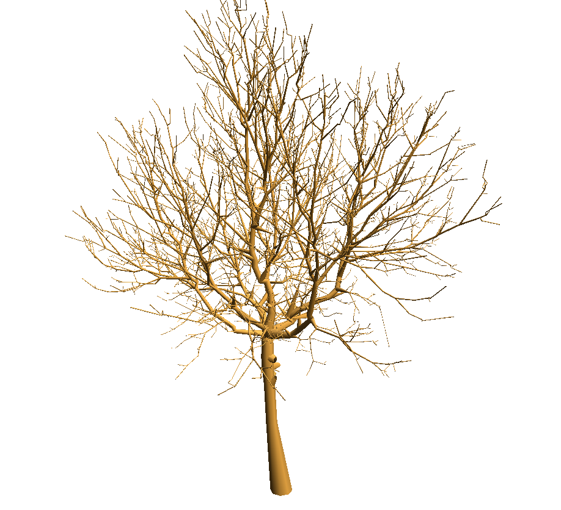
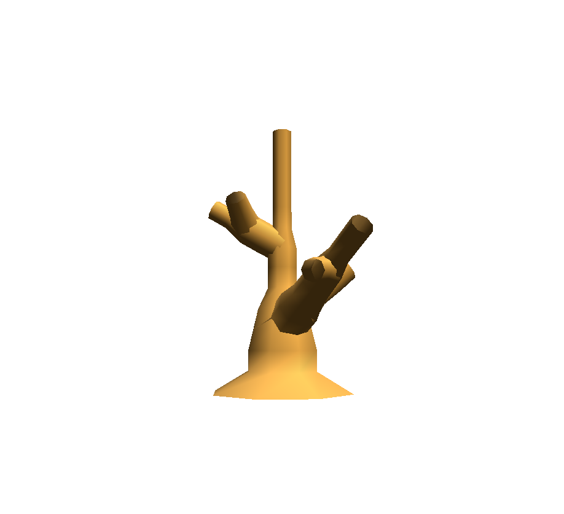
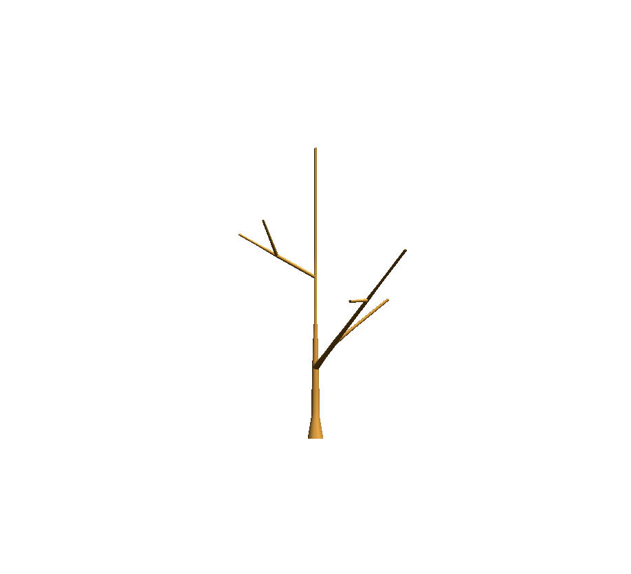
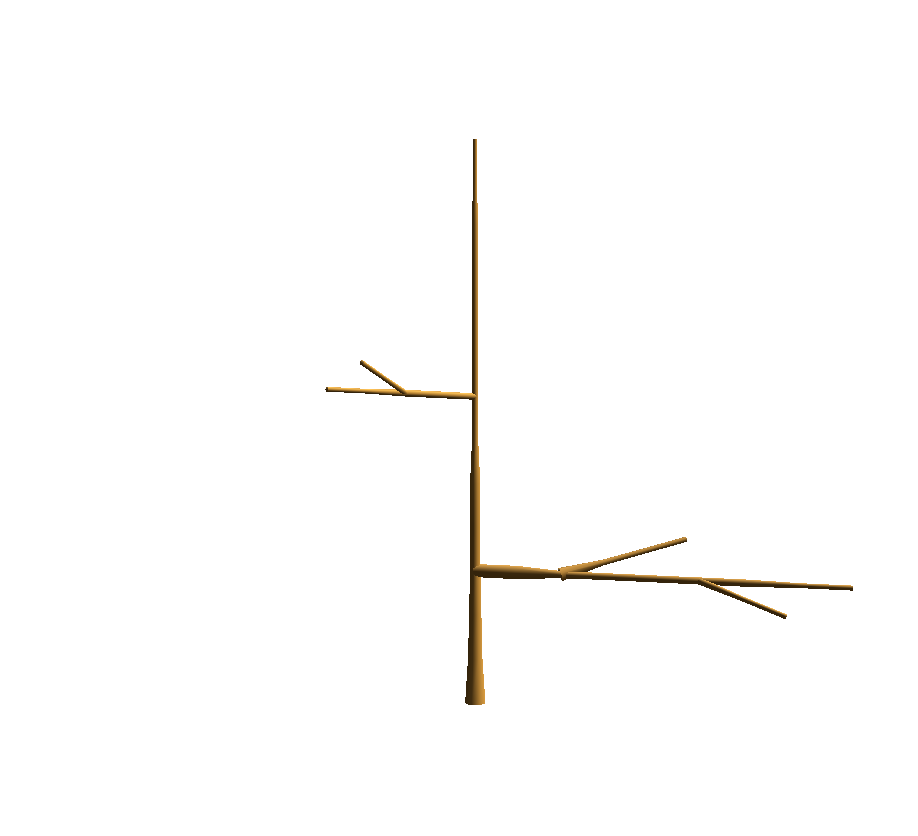

.. _tuto_plantframe:

PlantFrame (3D reconstruction of plant architecture)
#########################################################

.. topic:: Section contents

    In this section, we introduce the `PlantFrame`
    vocabulary that we use through-out `openalea` and give a 
    series of examples.

The problem setting
===================

PlantFrame is a method to compute the geometry of each organ of a Plant Architecture.
Geoemtrical data is associated to some vertices of the architecture (aka **MTG**).
But often, geometrical information is missing on some vertex.
Constraints have to be solved to compute missing values.

The stages of the PlantFrame are:
    #. Insert a scale at the axis level.
    #. Project all the constraints at the finer scale.
    #. Apply different *Knowledge Sources* (i.e. KS) on the MTG to compute the values at some nodes.
    #. Solve the constraints.
    #. Visualise the geometry using a 3D Turtle.

Where are the data?
==========================

 The `mtg` package comes with a few datasets. The data are in
 `src/openalea/mtg/data` directory from the root. ::

    >>> import openalea.mtg
    >>> from openalea.mtg.data import data_dir

Visualisation of a digitized Tree
=================================

First, we load the digitized Walnut :download:`noylum2.mtg <../../src/openalea/mtg/data/noylum2.mtg>`

::

    >>> from openalea.mtg import * 
    >>> g = MTG(data_dir/'noylum2.mtg')

Then, a file containing a set of default geometric parameters is loaded to build a
DressingData (:download:`walnut.drf <../../src/openalea/mtg/walnut.drf>` )

::

    >>> drf = data_dir/'walnut.drf'
    >>> dressing_data = dresser.dressing_data_from_file(drf)

Another solution is to create the default parameters directly

::
    >>> dressing_data = plantframe.DressingData(DiameterUnit=10)

Geometric parameters are missing. How to compute them?
Use the PlantFrame, a geometric solver working on multiscale tree structure.

Create the solver and solve the problem

::

    >>> pf = plantframe.PlantFrame(g, 
                           TopDiameter='TopDia',
                           DressingData = dressing_data)

Visualise the plant in 3D

::

    >>> pf.plot(gc=True)

Simple visualisation of a monopodial plant
===========================================

First,  we load the MTG :download:`monopodial_plant.mtg <../../src/openalea/mtg/monopodial_plant.mtg>`

.. literalinclude:: ../../src/openalea/mtg/data/monopodial_plant.mtg
    :lines: 22-
    
::

    >>> from openalea.mtg import * 
    >>> g = MTG(data_dir/'monopodial_plant.mtg')

.. code-block:: python

    >>> def coloring(mtg, vertex):
            try:
                mtg.property('diam')[vertex]
                return "g"
            except: return "r"

    >>> def legend(mtg, vertex):
            try:
                return "diam: "+str(mtg.property('diam')[vertex])
            except: return "diam: NA"
            
    >>> def label(mtg, vertex):
            return mtg.label(vertex)

    >>> g.plot(roots=4, node=dict(fc=coloring, label=label, legend=legend), prog="dot")
            
.. image:: images/monopod2d1.png
    :width: 80%
    :align: center
    :alt: PlantFrame            

.. code-block:: python

    >>> def legend(mtg, vertex):
            try:
                return "diam: "+str(mtg.property('diam')[vertex])
            except: return "diam: NA"
            
    >>> g.plot(roots=4, node=dict(fc=coloring, label=label, legend=legend), prog="dot")

.. image:: images/monopod2d2.png
    :width: 80%
    :align: center
    :alt: PlantFrame  

The mtg `monopodial_plant.mtg` is loaded. To draw it, just run::

    >>> pf = plantframe.PlantFrame(g, TopDiameter='diam')
    >>> pf.plot()

You can also define a function to compute the diameter::

    >>> def diam(v):
            d = g.node(v).diam
            return d/10. if d else None
    >>> pf = plantframe.PlantFrame(g, TopDiameter=diam)
    >>> pf.plot()

The **diameter** is defined for each vertex of the MTG.
To take into account the diameter, we have to define a visitor function.

.. code-block:: python

    diam = g.property('diam')

    def visitor(g, v, turtle):
        if g.edge_type(v) == '+':
            angle = 90 if g.order(v) == 1 else 30
            turtle.down(angle)
        turtle.setId(v)
        if v in diam:
            turtle.setWidth(diam[v]/2.)
        turtle.F(10)
        turtle.rollL()

    pf = plantframe.PlantFrame(g)
    pf.plot(g, visitor=visitor)

.. sectionauthor:: Christophe Pradal, Pierre Fernique
